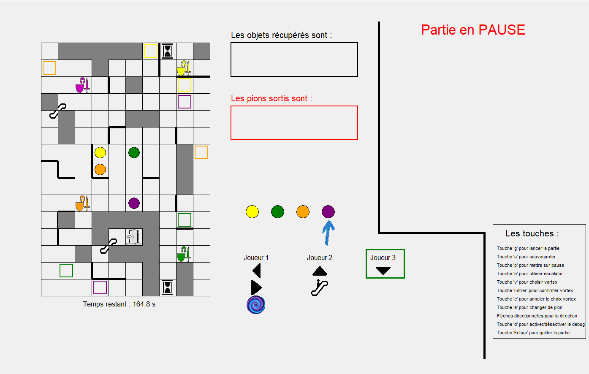

# Magic-maze
Adaptation en langage Python du jeu de société Magic-Maze





## Objectif du jeu :
Les 4 pions Héros doivent voler leur objet respectif en étant simultanément sur leur case objet. La sortie devient alors active et ils doivent se dépêcher pour y aller. Tout ça dans un temps limitté de 3 minutes.


## Exécuter le programme

Posséder [Python](https://www.python.org/downloads/) sur votre machine pour pouvoir exécuter le programme.

- Linux :
```
git clone https://github.com/Zecrum/Magic-maze.git
cd Magic-maze/src
python3 Magic-Maze.py
```

- Windows :
```
git clone https://github.com/Zecrum/Magic-maze.git
cd Magic-maze/src
python Magic-Maze.py
```


Version en date du 10/01/2021

#### Auteurs :
LAPLAIGE Alexandre

